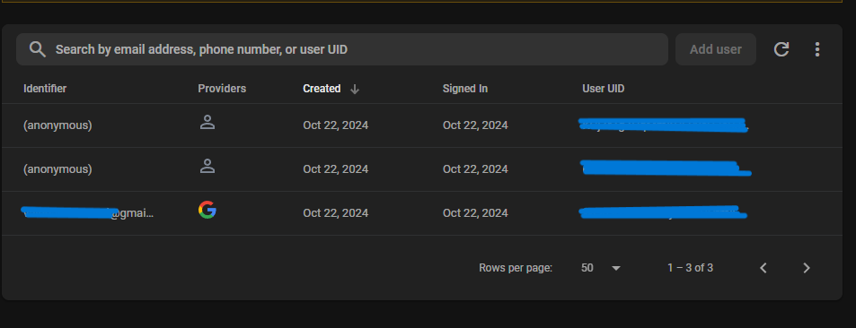

# Weather App Flutter

This is my attempt at making a flutter weather app. It implements Firebase as the backend and provides two options for login.
You can login using your Google account or use Anonymous sign in.


The default value of the place for weather is set as Delhi. You can search for the place you want using the search bar.

The search bar has a history feature which shows your previous searches. This data is stored in Firebase Database.


Search for the place you like and then click it for the home page to be updated accordingly.
The home page shows current place, its temperature, a map of the location, and some more details. The icons update based on what the weather at the place is (e.g. whether its raining or not)

Video demo:

[Demo](./demo_assets/demo.mp4)

The map is scrollable and updated based on the current searched location.

The floating button can be used to sign out of the app if the user so desires.

Video demo:

[Sign Out](./demo_assets/sign_out.mp4)

## Development

### Prerequisites

- Flutter SDK
- OpenWeatherMap API key
- Firebase account

1.Clone the repository:

```bash
git clone https://github.com/Va1bhav512/weather_app_flutter
```

2.Navigate to the project directory:

```bash
cd weather_app_flutter
```

3.Make a .env file

```bash
mkdir .env
```

4.Add your OpenWeatherMap API key to the .env file:

```txt
apiKey = your_api_key_here
```

5.Install the dependencies:

```bash
flutter pub get
```

6.Setup Firebase

Follow the official Google Firebase documentation to set up firebase with flutter

7.Run the app

```bash
flutter run
```

If you prefer not to build from source then you can use the apk in the appropriate directory
or run

```bash
flutter build apk --release
```
